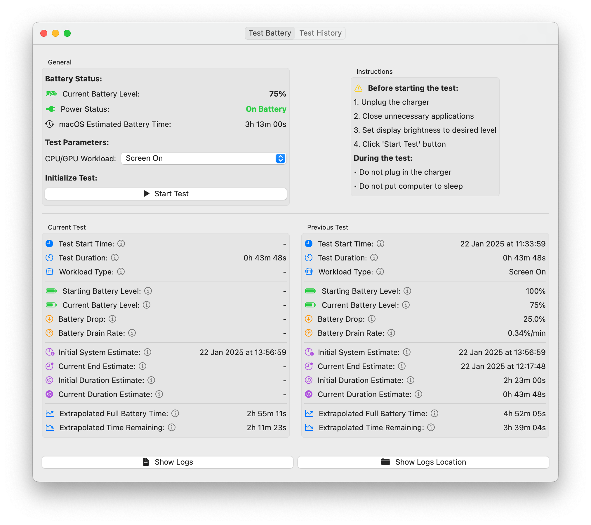

# Real Battery Tester

A comprehensive battery testing tool for macOS that helps diagnose battery health and performance. Unlike standard battery indicators that rely on estimations, this tool is designed to realistically simulate real-life scenarios and measure actual battery strength. It allows you to determine precisely how long your computer will operate on battery power until shutdown under various usage conditions.

## Features

- Real-time battery monitoring
- Multiple test workload options
- Detailed test history
- Battery drain rate analysis
- Extrapolated battery life calculations
- Visual status indicators with SF Symbols

## Requirements

- macOS 13.0 or later
- Apple Silicon or Intel Mac

## Installation

Download the latest release DMG file from the [Releases](https://github.com/bpetrynski/real-battery-tester/releases) page.

## Building from Source

1. Clone the repository
2. Open the project in Xcode
3. Build and run

## Author

Bartosz Petrynski

## License

This project is licensed under the MIT License.
